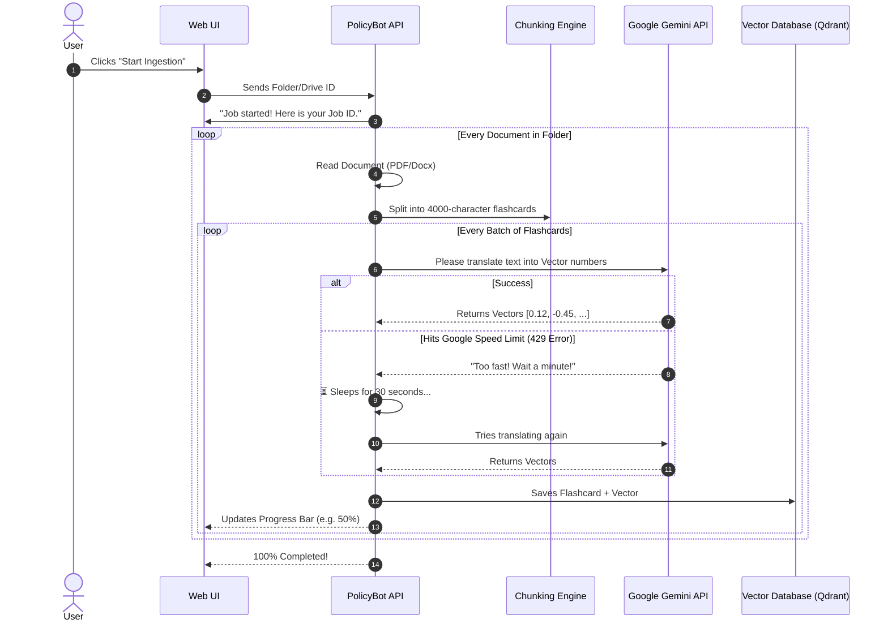

# Ingestion Optimization and Smart Chunking

## Architecture Improvements

The ingestion pipeline has been completely overhauled to support thousands of documents efficiently without freezing the UI or hanging on errors.

### Smart Conditional Chunking & Large Contexts
Instead of blindly chunking all text by character counts, the `DocumentLoader` and `ChunkingService` now detect the file type and apply context-aware parsing:
- **Markdown (`.md`)**: Chunked using LangChain's `MarkdownTextSplitter` to keep headers and logical sections intact.
- **CSV (`.csv`)**: Row data is preserved to keep table context.
- **PDF (`.pdf`) & Docx (`.docx`)**: Extract text incrementally and use `RecursiveCharacterTextSplitter`.

**API Optimization**: We increased the `CHUNK_SIZE` from `1000` to `4000` characters. Gemini 1.5 and 2.0 can handle huge contexts natively. By passing much larger chunks:
1. We dramatically reduce the number of requests sent to the embedding API.
2. We retain deeper semantic meaning per chunk.
3. We avoid instantly tripping Google Gemini Free Tier limits (which allow exactly 100 embedding requests per minute).

### Lazy Loading & Concurrency
The `DocumentLoader` now acts as an `AsyncGenerator`, yielding text blocks incrementally. The `IngestionService` consumes this stream in batches, sending them concurrently (`asyncio.gather`) to the Embedding API and Vector DB (Qdrant). This ensures the event loop is never blocked, allowing real-time WebSocket updates to flow continuously to the UI.

### Fault Tolerance and Rate Limit Self-Healing
If the system hits a hard `429 Quota Exceeded` error from Google API, it does not crash or give up. We built an automated exponential backoff directly into the `GeminiProvider`. The system will silently pause for 30 seconds, catch its breath, and seamlessly retry embedding the chunk. 

### Real-time Logs
The ingestion process now pushes granular details to the frontend:
- Current Document being processed
- Real-time batch counts and chunk metrics
- Error messages explicitly displayed instead of failing silently.

---

## 🧒 How Ingestion Works (Explained Like You're 10)

Imagine you have a giant stack of messy school textbooks, and your job is to read all of them and make tiny flashcards so that anyone can ask you a question and you can instantly hand them the right flashcard with the answer. 

Here is how our robot (PolicyBot) does it:

1. **The Scanner (Looking at the Books)**: First, the robot opens the folder you gave it and makes a list of every single book inside (PDFs, Word documents, etc.).
2. **The Chunking (Making Flashcards)**: Instead of trying to memorize an entire 500-page book at once, the robot carefully cuts the book into smaller pieces—like paragraphs or chapters. We call these "chunks". We made the chunks extra big (4000 characters) so the robot doesn't lose the context of the story.
3. **The Embedding (Translating to Robot Math)**: The robot can't read English the way we do. So, it sends each flashcard to a super-brain (Google Gemini API). Gemini reads the English and translates it into a giant list of numbers (called vectors). If two flashcards talk about the same thing, their numbers will be very similar!
4. **The Database (The Filing Cabinet)**: The robot takes the flashcard (the text) and the translation (the numbers) and files them away in a super-fast filing cabinet called **Qdrant**. 
5. **Taking a Break (The Rate Limit)**: The super-brain (Google Gemini) only lets the robot ask for 100 translations every minute. If the robot asks too fast, Gemini says "Whoa, slow down!" (This is a 429 Error). When that happens, our robot politely waits 30 seconds and then asks again without complaining.

### Diagram: The Ingestion Flow

